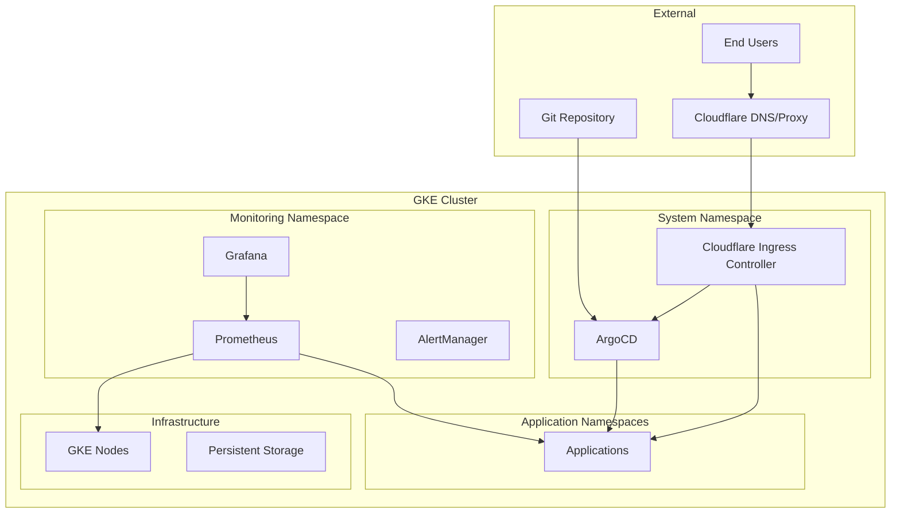

# Design Document

## Overview

This design outlines the architecture for a production-ready GKE cluster with GitOps deployment capabilities through ArgoCD, external traffic management via Cloudflare Ingress Controller, and comprehensive monitoring. The system follows cloud-native best practices and provides a scalable foundation for application deployment and operations.

## Architecture

### High-Level Architecture



### Network Architecture

- **GKE Cluster**: Private cluster with authorized networks for security
- **Node Pools**: Separate pools for system workloads and application workloads
- **Ingress**: Cloudflare Ingress Controller managing external traffic
- **Internal Communication**: Service mesh or standard Kubernetes networking
- **DNS**: Cloudflare DNS integration for external endpoints

## Components and Interfaces

### 1. GKE Cluster Configuration

**Purpose**: Managed Kubernetes environment with appropriate security and networking

**Key Components**:
- Master nodes (managed by Google)
- Worker node pools with auto-scaling
- Network policies for security
- RBAC configuration
- Storage classes for persistent volumes

**Configuration**:
- Private cluster with authorized networks
- Workload Identity for secure GCP service access
- Network policy enforcement enabled
- Automatic node upgrades and repairs
- Multiple availability zones for high availability

### 2. ArgoCD Deployment

**Purpose**: GitOps continuous delivery platform

**Key Components**:
- ArgoCD Server (API and Web UI)
- ArgoCD Application Controller
- ArgoCD Repository Server
- ArgoCD Redis (for caching)
- ArgoCD Notifications Controller

**Configuration**:
- High availability setup with multiple replicas
- Persistent storage for application definitions
- RBAC integration with cluster authentication
- Git repository connections with SSH/HTTPS
- Application project isolation

**Interfaces**:
- Web UI accessible via Cloudflare ingress
- CLI access for automation
- Webhook endpoints for Git integration
- Metrics endpoints for monitoring

### 3. Cloudflare Ingress Controller

**Purpose**: External traffic management and security through Cloudflare

**Key Components**:
- Ingress Controller deployment
- Cloudflare API integration
- Certificate management
- Traffic routing rules

**Configuration**:
- Cloudflare API credentials via secrets
- Automatic DNS record management
- SSL/TLS certificate provisioning
- DDoS protection and WAF rules
- Load balancing configuration

**Interfaces**:
- Kubernetes Ingress resources
- Cloudflare API for DNS/proxy management
- Certificate management integration
- Metrics and logging endpoints

### 4. Monitoring Stack

**Purpose**: Comprehensive observability for cluster and applications

**Key Components**:
- Prometheus (metrics collection and storage)
- Grafana (visualization and dashboards)
- AlertManager (alerting and notifications)
- Node Exporter (node metrics)
- kube-state-metrics (Kubernetes object metrics)

**Configuration**:
- Persistent storage for metrics data
- Service discovery for automatic target detection
- Pre-configured dashboards for Kubernetes monitoring
- Alert rules for critical system events
- Integration with external notification systems

## Data Models

### Cluster Configuration

```yaml
apiVersion: container.v1
kind: Cluster
metadata:
  name: production-gke-cluster
spec:
  location: us-central1
  nodeConfig:
    machineType: e2-standard-4
    diskSizeGb: 100
    oauthScopes:
      - https://www.googleapis.com/auth/cloud-platform
  networkPolicy:
    enabled: true
  workloadIdentityConfig:
    workloadPool: PROJECT_ID.svc.id.goog
```

### ArgoCD Application

```yaml
apiVersion: argoproj.io/v1alpha1
kind: Application
metadata:
  name: sample-app
  namespace: argocd
spec:
  project: default
  source:
    repoURL: https://github.com/example/app-manifests
    targetRevision: HEAD
    path: manifests
  destination:
    server: https://kubernetes.default.svc
    namespace: default
  syncPolicy:
    automated:
      prune: true
      selfHeal: true
```

### Ingress Configuration

```yaml
apiVersion: networking.k8s.io/v1
kind: Ingress
metadata:
  name: argocd-ingress
  annotations:
    kubernetes.io/ingress.class: cloudflare
    cert-manager.io/cluster-issuer: cloudflare-issuer
spec:
  tls:
    - hosts:
        - argocd.example.com
      secretName: argocd-tls
  rules:
    - host: argocd.example.com
      http:
        paths:
          - path: /
            pathType: Prefix
            backend:
              service:
                name: argocd-server
                port:
                  number: 80
```

## Error Handling

### Cluster Provisioning Failures

- **Validation**: Pre-flight checks for quotas, permissions, and network configuration
- **Retry Logic**: Automatic retry with exponential backoff for transient failures
- **Rollback**: Ability to destroy partially created resources on failure
- **Logging**: Comprehensive logging of provisioning steps and errors

### ArgoCD Deployment Issues

- **Health Checks**: Readiness and liveness probes for all components
- **Dependency Management**: Proper startup ordering and dependency checks
- **Recovery**: Automatic restart policies and persistent data recovery
- **Sync Failures**: Detailed error reporting and manual intervention capabilities

### Ingress Controller Problems

- **API Connectivity**: Health checks for Cloudflare API connectivity
- **Certificate Issues**: Automatic certificate renewal and fallback mechanisms
- **DNS Propagation**: Monitoring and alerting for DNS propagation delays
- **Traffic Routing**: Fallback routing and circuit breaker patterns

### Monitoring Stack Failures

- **Data Persistence**: Backup and recovery procedures for metrics data
- **Service Discovery**: Fallback mechanisms for target discovery failures
- **Alert Delivery**: Multiple notification channels and escalation policies
- **Dashboard Availability**: High availability setup for critical dashboards

## Testing Strategy

### Infrastructure Testing

- **Terraform/Manifest Validation**: Syntax and semantic validation of infrastructure code
- **Dry-run Deployments**: Test deployments in isolated environments
- **Resource Quotas**: Validation of resource requirements and limits
- **Network Connectivity**: End-to-end connectivity testing

### Integration Testing

- **ArgoCD Sync Testing**: Automated testing of application deployment workflows
- **Ingress Functionality**: Testing of external access and SSL termination
- **Monitoring Integration**: Validation of metrics collection and alerting
- **Backup and Recovery**: Testing of disaster recovery procedures

### Security Testing

- **RBAC Validation**: Testing of role-based access controls
- **Network Policies**: Validation of network segmentation and policies
- **Secret Management**: Testing of secret rotation and access controls
- **Vulnerability Scanning**: Regular scanning of container images and cluster components

### Performance Testing

- **Load Testing**: Testing cluster performance under various load conditions
- **Scaling Tests**: Validation of auto-scaling behavior
- **Resource Utilization**: Monitoring of resource usage patterns
- **Latency Testing**: End-to-end latency measurements for critical paths

## Security Considerations

### Cluster Security

- Private cluster configuration with authorized networks
- Workload Identity for secure service-to-service communication
- Network policies for micro-segmentation
- Regular security updates and patches
- Pod Security Standards enforcement

### Access Control

- RBAC integration with identity providers
- Service account management with minimal privileges
- API server access controls and audit logging
- Secret management with encryption at rest
- Certificate-based authentication for components

### Network Security

- TLS encryption for all inter-component communication
- Cloudflare security features (DDoS protection, WAF)
- Network policies for traffic isolation
- Secure ingress with proper certificate management
- VPN or bastion host access for administrative tasks

## Deployment Strategy

### Phase 1: Infrastructure Setup

1. GKE cluster provisioning with basic configuration
2. Node pool creation and networking setup
3. RBAC and security policy configuration
4. Storage class and persistent volume setup

### Phase 2: Core Services

1. ArgoCD installation and configuration
2. Cloudflare Ingress Controller deployment
3. Basic monitoring stack deployment
4. Initial security hardening

### Phase 3: Integration and Exposure

1. ArgoCD ingress configuration through Cloudflare
2. Monitoring dashboard setup and configuration
3. Application namespace preparation
4. End-to-end testing and validation

### Phase 4: Monitoring and Operations

1. Comprehensive monitoring setup
2. Alerting rule configuration
3. Backup and disaster recovery setup
4. Documentation and runbook creation